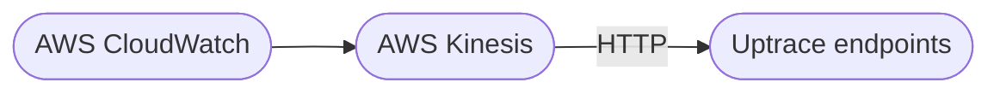

# Ingesting AWS CloudWatch metrics and logs

AWS CloudWatch allows to forward metrics and logs to third-party destinations using AWS Kinesis Data Firehose. Uptrace provides compatible HTTP endpoints for AWS Kinesis so you can monitor your AWS infrastructure with Uptrace.

[[toc]]

## Metrics

CloudWatch Metrics is a monitoring service provided by Amazon Web Services (AWS) that allows you to collect and track metrics from your applications and infrastructure resources in real-time.

You can configure AWS CloudWatch to send metrics to Uptrace using AWS Kinesis Data Firehose.

### Terraform module

Uptrace provides a [Terraform module](https://github.com/uptrace/terraform-aws-integrations/tree/master/modules/cloudwatch-metrics) that configures AWS CloudWatch to send metrics to Uptrace. Refer to the module's readme for details.

### AWS Console

You can also configure CloudWatch manually using the AWS Console.

1. Create a new [Kinesis Data Firehose Delivery Stream](https://docs.aws.amazon.com/firehose/latest/dev/basic-create.html) with the following details:

   - Stream source: **Direct PUT**
   - Kinesis endpoint: `https://api.uptrace.dev/api/v1/cloudwatch/metrics`
   - API Key: Enter the **Uptrace DSN** for your project.
   - Content Encoding: **GZIP**.

2. Create a new [CloudWatch Metric Stream](https://docs.aws.amazon.com/AmazonCloudWatch/latest/monitoring/CloudWatch-metric-streams-setup.html).

   1. Open the [CloudWatch AWS console](https://console.aws.amazon.com/cloudwatch/).
   1. Choose **Metrics → Streams**.
   1. Click the **Create metric stream** button.
   1. Choose CloudWatch metric namespaces to include in the metric stream.
   1. Choose **Select an existing Firehose owned by your account**, and select the Firehose Delivery Stream you created earlier.
   1. Specify an Output Format of `json`.
   1. Optionally, specify a name for this metric stream under **Metric Stream Name**.
   1. Click on the **Create metric stream** button.

## Logs

[CloudWatch Logs](https://docs.aws.amazon.com/AmazonCloudWatch/latest/logs/aws-services-sending-logs.html) is a log management service provided by Amazon Web Services (AWS) that allows you to collect, monitor, and analyze log files from your applications and infrastructure.

You can configure AWS CloudWatch to send logs to Uptrace using AWS Kinesis Data Firehose.

### Terraform module

Uptrace provides a [Terraform module](https://github.com/uptrace/terraform-aws-integrations/tree/master/modules/cloudwatch-logs) that configures AWS CloudWatch to send logs to Uptrace. Refer to the module's readme for details.

### AWS Console

You can also configure CloudWatch manually using the AWS Console.

1. Create a new [Kinesis Data Firehose Delivery Stream](https://docs.aws.amazon.com/firehose/latest/dev/basic-create.html) with the following details:

   - Stream source: **Direct PUT**
   - Kinesis endpoint: `https://api.uptrace.dev/api/v1/cloudwatch/logs`
   - API Key: Enter the **Uptrace DSN** for your project.
   - Content Encoding: **GZIP**.

2. Create a new [CloudWatch log group](https://docs.aws.amazon.com/AmazonCloudWatch/latest/logs/Working-with-log-groups-and-streams.html) using the Firehose Delivery Stream you created earlier.

## Conclusion

AWS CloudWatch is a powerful tool for monitoring, collecting, and analyzing data from your AWS resources and applications. It helps you identify and resolve issues, optimize resource utilization, and ensure the overall performance and availability of your AWS infrastructure.

Using AWS Kinesis Data Firehose, you can forward metrics and logs to Uptrace, [open source APM tool](../open-source-apm.md) that supports distributed tracing, metrics, and logs.

- [OpenTelemetry Go Lambda](../instrument/opentelemetry-go-lambda.md)
- [OpenTelemetry Node.js Lambda](../instrument/opentelemetry-node-lambda.md)
