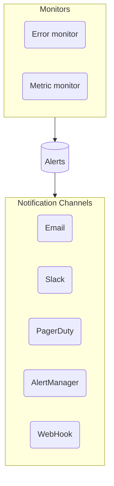

# Alerting and Notifications

Uptrace supports 2 types of monitors: **metric** and **error** monitors.

Metric monitors allow you to create alerts and receive notifications when metric values meet certain conditions, for example, the number of failed requests is greater than 100 in the last 3 minutes.

Error monitors allow to receive notifications for certain errors (exceptions) and logs, for example, there is a production log with the severity level `ERROR`. The number of logs does not matter.



[[toc]]

## Notification channels

You can create notification channels to receive notifications via email, Slack/Mattermost, Telegram, Microsoft Teams, [PagerDuty](enterprise.md#pagerduty), [Opsgenie](enterprise.md#opsgenie), AlertManager, and webhooks. You can specify which notification channels to use when creating monitors.

To create a notification channel:

1. Go to the "Alerting" -> "Channels" tab.
2. Click on the "New channel" -> "Slack" to open a form.

## Monitoring metrics

Uptrace allows to create alerts when the monitored metric value meets certain conditions, for example, you can create an alert when `system_filesystem_usage` metric exceeds 90%.

### Examples

Here are some examples of metric monitors you can create to monitor [OpenTelemetry host metric](https://uptrace.dev/opentelemetry/collector-host-metrics.html). This guide uses YAML syntax to define monitors, but usually you will create monitors using Uptrace UI.

To monitor CPU usage:

```yaml
monitors:
  - name: CPU usage
    type: metric
    metrics:
      - system_cpu_load_average_15m as $load_avg_15m
      - system_cpu_time as $cpu_time
    query:
      - $load_avg_15m / uniq($cpu_time.cpu) as cpu_util
      - group by host_name
    column: cpu_util
    column_unit: utilization
    max_allowed_value: 3
    check_num_point: 10
```

To monitor filesystem usage:

```yaml
monitors:
  - name: Filesystem usage
    type: metric
    metrics:
      - system_filesystem_usage as $fs_usage
    query:
      - $fs_usage{state='used'} / $fs_usage as fs_util
      - group by host_name, mountpoint
      - where mountpoint !~ "/snap"
    column: fs_util
    column_unit: utilization
    max_allowed_value: 0.9
    check_num_point: 3
```

To monitor number of disk pending operations:

```yaml
monitors:
  - name: Disk pending operations
    type: metric
    metrics:
      - system_disk_pending_operations as $pending_ops
    query:
      - $pending_ops
      - group by host_name, device
    max_allowed_value: 100
    check_num_point: 10
```

To monitor network errors:

```yaml
monitors:
  - name: Network errors
    type: metric
    metrics:
      - system_network_errors as $net_errors
    query:
      - $net_errors
      - group by host_name
    max_allowed_value: 0
    check_num_point: 3
```

## Monitoring spans, events, and logs

You can also monitor tracing data using the following system metrics created by Uptrace:

- `uptrace_tracing_spans`. Number of spans and their duration (excluding events and logs).
- `uptrace_tracing_logs`. Number of logs (excluding spans and events).
- `uptrace_tracing_events`. Number of events (excluding spans and logs).

You can use all available span attributes for filtering and grouping, for example, `where _status_code = 'error'` or `group by host_name`.

### Examples

To monitor average PostgreSQL `SELECT` query duration:

```yaml
monitors:
  - name: PostgreSQL SELECT duration
    type: metric
    metrics:
      - uptrace_tracing_spans as $spans
    query:
      - avg($spans)
      - where _system = 'db:postgresql'
      - where db_operation = 'SELECT'
    max_allowed_value: 10000 # 10 milliseconds
    check_num_point: 5
```

To monitor median duration of all database operations:

```yaml
monitors:
  - name: Database operations duration
    type: metric
    metrics:
      - uptrace_tracing_spans as $spans
    query:
      - p50($spans)
      - where _type = "db"
    max_allowed_value: 10000 # 10 milliseconds
    check_num_point: 5
```

To monitor number of errors:

```yaml
monitors:
  - name: Number of errors
    type: metric
    metrics:
      - uptrace_tracing_logs as $logs
    query:
      - perMin(sum($logs))
      - where _system in ("log:error", "log:fatal")
    max_allowed_value: 10
    check_num_point: 3
```

To monitor failed requests:

```yaml
monitors:
  - name: Failed requests
    type: metric
    metrics:
      - uptrace_tracing_spans as $spans
    query:
      - perMin(count($spans{_status_code="error"})) as failed_requests
      - where _type = "httpserver"
    max_allowed_value: 0
```

## Monitoring errors and logs

Uptrace automatically creates an error monitor for logs with `log_severity` levels `ERROR` and `FATAL`.

You can use all available filters to include/exclude monitored logs. You can also customize default filters to monitor `WARN` logs.

You can add `group by` clauses to customize the default errors grouping and create a separate alert/notification, for example, `group by _group_id, service_name, cloud_region`.

The monitor sends a notification when a new error occurs, and then periodically reminds you about the error.

### Examples

To monitor all errors:

```yaml
monitors:
  - name: Notify on all errors
    type: error
    notify_everyone_by_email: true
    query:
      - group by _group_id
      - where _system in ("log:error", "log:fatal")
```

To monitor exceptions:

```yaml
monitors:
  - name: Exceptions
    type: error
    notify_everyone_by_email: true
    query:
      - group by _group_id
      - group by exception_type
      - where _system in ("log:error", "log:fatal")
      - where exception_type exists
```

To monitor all errors in each environment except `dev`:

```yaml
monitors:
  - name: Notify on all errors
    type: error
    notify_everyone_by_email: true
    query:
      - group by _group_id
      - group by deployment_environment
      - where _system in ("log:error", "log:fatal")
      - where deployment_environment != "dev"
```

## Notification frequency

When an alert is created, Uptrace sends a notification and then periodically reminds you about the alert.

The notification frequency decreases over time and is different for metric and error monitors:

- Metric monitors: 15m, 15m, 30m, 30m, 1h, 1h, 1h, 1h, 1h, 24h.
- Error monitors: 1h, 1h, 6h, 6h, 6h, 24h, 24h, 24h, 24h, 24h, 1w.

The total number of notifications is not limited, for example, if a metric monitor never recovers, you will receive notifications every 24 hours indefinitely.

When an alert is closed, Uptrace sends a corresponding notification.

## Email notifications

<!-- prettier-ignore -->
::: tip
The information below is only relevant to users of the Uptrace Community Edition.
:::

To receive email notifications in the Uptrace Community version, make sure users have correct email addresses and the `smtp_mailer` is properly configured and enabled:

```yaml
# uptrace.yml

auth:
  users:
    - name: John Smith
      email: john.smith@gmail.com
      password: uptrace
      notify_by_email: true

smtp_mailer:
  enabled: true
  host: smtp.gmail.com
  port: 587
  username: '[SENDER]@gmail.com'
  password: '[APP_PASSWORD]'
  from: '[SENDER]@gmail.com'
```

Note that Gmail does not allow to use your real password in `smtp_mailer.password`. Intead, you should generate an app password for Gmail:

1. In Gmail, click on your avatar -> "Manage your Google Account".
2. On the left, click on "Security".
3. Scroll to "Signing in to Google" and click on "App password".

See [Gmail documentation](https://support.google.com/accounts/answer/185833?hl=en) for details.
