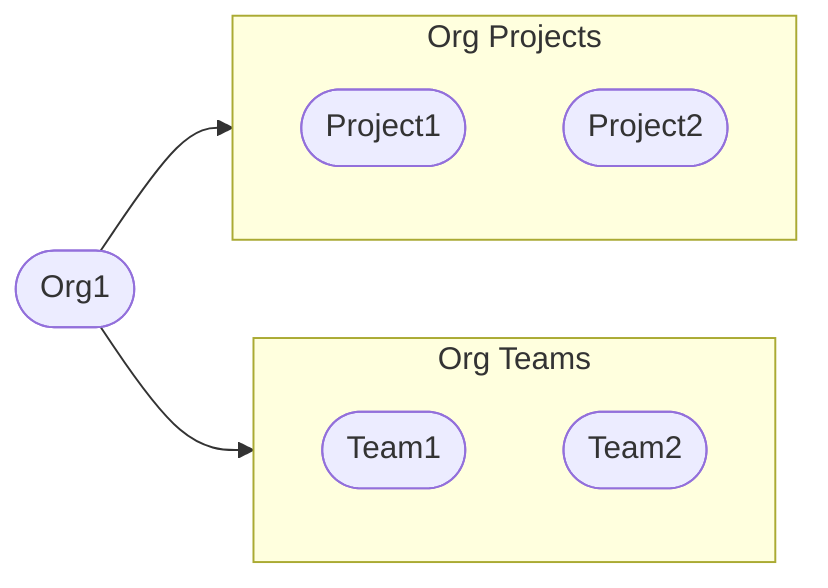
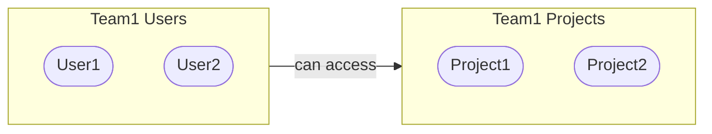

# Uptrace Enterprise Edition

Uptrace comes in 2 editions: Uptrace Community Edition (Uptrace CE) and Uptrace Enterprise Edition (Uptrace EE).

Uptrace Community Edition is a free software with the [source code](https://github.com/uptrace/uptrace) available on GitHub.

Uptrace Enterprise Edition is a commercial software that offers optimized performance and some additional features on top of Uptrace CE. It can handle large volumes of data and scale horizontally to accommodate an expanding monitoring infrastructure.

You can either host Uptrace Enterprise on [your own servers](on-premise.md) or use Uptrace Cloud.

| Feature                                           | Community          | Cloud & Enterprise |
| ------------------------------------------------- | ------------------ | ------------------ |
| [Optimized storage and costs](#optimized-storage) | :x:                | :heavy_check_mark: |
| Custom data retention                             | :x:                | :heavy_check_mark: |
| [Huge traces](#huge-traces)                       | :x:                | :heavy_check_mark: |
| [Organizations](#organizations)                   | :x:                | :heavy_check_mark: |
| [Single Sign-On](#sso)                            | :x:                | :heavy_check_mark: |
| [OpenID connect](#oidc)                           | :heavy_check_mark: | :heavy_check_mark: |
| [SAML](#saml)                                     | :x:                | :heavy_check_mark: |
| Two-factor authentication                         | :x:                | :heavy_check_mark: |
| [PagerDuty notifications](#pagerduty)             | :x:                | :heavy_check_mark: |
| [OpsGenie notifications](#opsgenie)               | :x:                | :heavy_check_mark: |
| [Anomaly detection](#anomaly-detection)           | :x:                | :heavy_check_mark: |
| [Improved logs grouping](#improved-grouping)      | :x:                | :heavy_check_mark: |
| [Source maps processing](#sourcemaps)             | :x:                | :heavy_check_mark: |

## Optimized storage

Uptrace Enterprise support data pre-aggregation for common queries, efficient PostgreSQL and ClickHouse sharding, and improved support for cold storage such as S3.

Uptrace EE also supports improved storage policies that give you more flexibility to move data between hot (SSD) and cold storage (S3, HDD). It allows you to store less data on SSDs and reduce storage costs without sacrificing performance.

In addition to PostgreSQL and ClickHouse, Uptrace EE also uses Kafka for queuing incoming telemetry data and Redis key-value database for caching. Kafka ensures that Uptrace never loses your data if the ClickHouse or PostgreSQL databases are unavailable.

Compared with the Community Edition, Uptrace EE can reduce your monitoring costs and provide a better overall experience when scaling Uptrace to work with petabytes of data.

## Huge traces

Uptrace Enterprise supports huge traces with 100,000 spans and more by grouping and aggregating similar spans together. You can still explore the individual spans by clicking on the aggregated span groups.

## Organizations

Uptrace EE allows to group projects and users into orgs and teams.



You can then use teams to restrict access to projects.



And notify whole teams by email:


## SSO

Single Sign-On (SSO) is an authentication method that allows users to access multiple applications or services using a single set of credentials (such as a user name and password). Rather than requiring users to log in to each application separately, SSO enables them to authenticate once and gain seamless access to all connected systems.

SSO enables you to manage user access and permissions from a central point, simplifying user provisioning and deprovisioning.

Uptrace supports single sign-on using [OIDC](#oidc) and [SAML](#saml) authentication protocols.

## OIDC

OpenID Connect is an authentication protocol based on OAuth 2.0. It provides a way for applications to securely authenticate users and obtain their identity information.

OpenID Connect is often used for single sign-on (SSO) scenarios, where a user can log in once and access multiple applications without having to log in separately for each.

The following OIDC providers have been tested:

- [Google](sso/google.md)
- [Keycloak](sso/keycloak.md)
- [Okta](sso/okta.md)

## SAML

SAML (Security Assertion Markup Language) is a protocol used for authentication and authorization between different parties, such as an identity provider (IdP) and a service provider (SP). SAML allows users to access multiple services or applications using a single set of login credentials.

The following SAML identity providers have been tested:

- [Okta](sso/okta.md)
- Auth0
- Shibboleth
- Ipsilon
- OneLogin
- Azure Active Directory (Azure AD)

## PagerDuty

PagerDuty is a cloud-based incident management platform that allows teams to quickly respond to and resolve incidents in real-time.

Uptrace provides PagerDuty integration to automate incident response and streamline communication between teams.


## OpsGenie

OpsGenie is a popular incident management and alerting tool used by businesses and IT teams to manage and respond to incidents effectively. It is designed to help organizations handle and resolve critical issues and outages in a streamlined and collaborative manner.

The integration between Uptrace and OpsGenie allows you to streamline your incident management process and improve collaboration between monitoring and operations teams.

With this integration, you can automatically create and manage incidents in OpsGenie based on alerts generated by Uptrace. This enables faster response times and ensures that the right people are notified when critical issues arise.


## Anomaly detection

Anomaly detection is a technique used to identify data points or events that deviate significantly from the expected or normal behavior of a system or a population. The anomalies are often indicative of errors, fraud, or unusual events that require further investigation.

You can use anomaly detection on spans, events, logs, and metrics.


## Improved grouping

Uptrace EE allows to merge different groups together. For example, if the same HTTP handler is available under different routes, you can merge groups together to get more accurate stats:


Uptrace EE also comes with improved SQL grouping, for example, it is able to properly group the following queries:

```sql
-- group 1
SELECT * FROM spans WHERE id = 1
SELECT * FROM spans WHERE id = 2

-- group 2
SELECT * FROM events WHERE id = 1
SELECT * FROM events WHERE id = 2

-- group 3
SELECT * FROM events WHERE category_id = 1
SELECT * FROM events WHERE category_id = 2
```

Uptrace EE also improves logs grouping, for example:

```
# group 1
Invalid user webmaster from 127.0.0.1
Invalid user root from 127.0.0.1
Invalid user pgadmin from 127.0.0.1

# group 2
sqlparser.Parse failed
sqlparser.Parse failed

# group 3
db.Ping failed
db.Ping failed

# group 4
Function foo failed
Function bar failed
```

Lastly, you can manually adjust log grouping patterns to extract some logs into a separate group.

## Sourcemaps

Source maps provide mappings between the transformed code and the original code, allowing developers to trace back errors or exceptions to the correct location in the original source.

When an error or exception occurs in the transformed code, Uptrace uses the source map to reverse the mappings and determine the original location in the source files where the error occurred. This information is then presented to you, making it easier to identify and fix problems.

## Have questions?

[Send](mailto:support@uptrace.dev) us an email or [schedule](https://calendly.com/vmihailenco/30min) a call. We reply as soon as possible.
