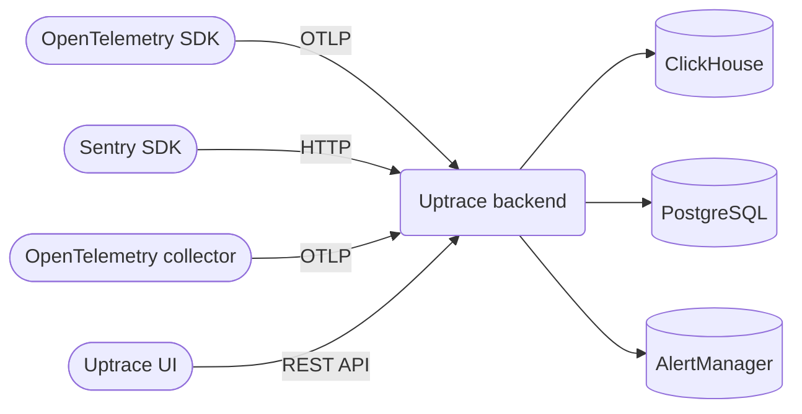

```mermaid
flowchart LR
    client([OpenTelemetry SDK])
    sentry([Sentry SDK])
    collector([OpenTelemetry collector])
    uptrace(Uptrace backend)
    ch[(ClickHouse)]
    pg[(PostgreSQL)]
    alertmanager[(AlertManager)]
    ui([Uptrace UI])

    client -->|OTLP| uptrace
    sentry -->|HTTP| uptrace
    collector -->|OTLP| uptrace
    uptrace --> ch
    uptrace --> pg
    uptrace --> alertmanager
    ui -->|REST API| uptrace
```
